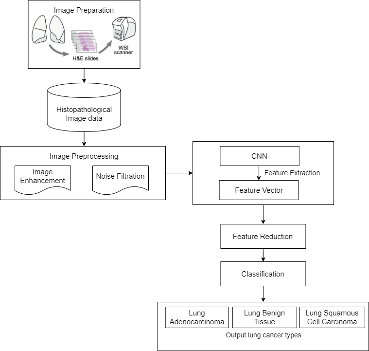
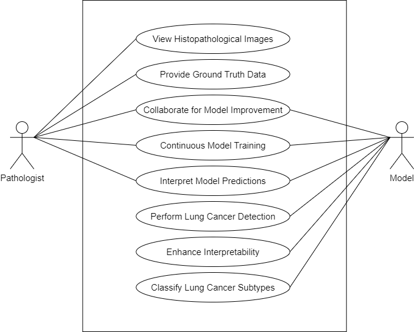
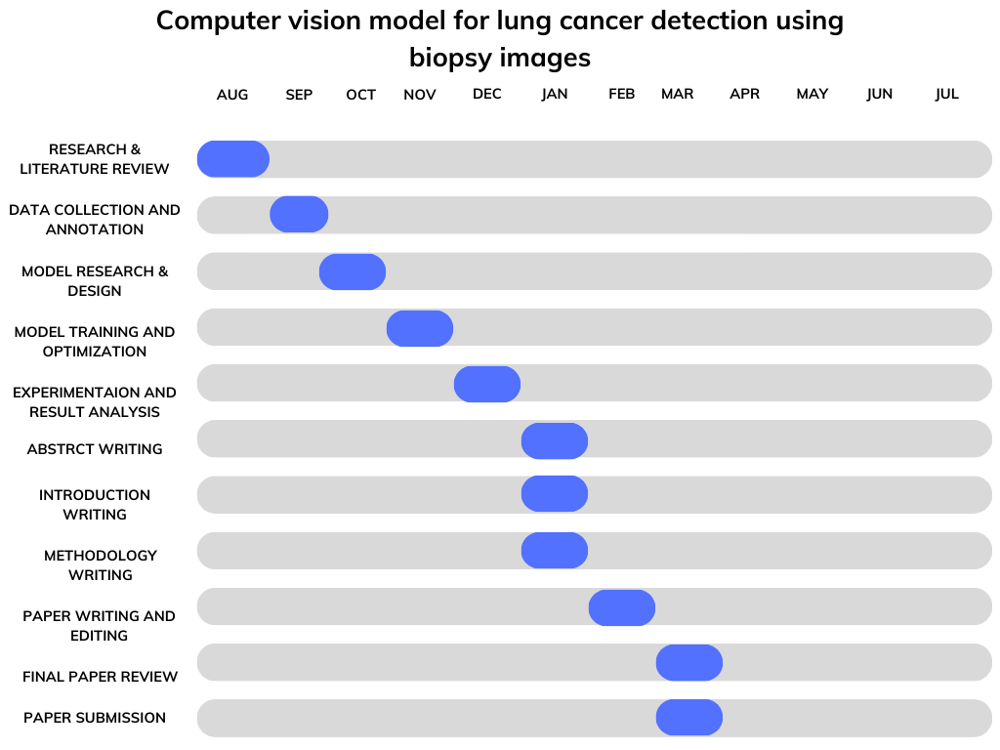

# Computer Vision Model for Lung Cancer Detection using Biopsy Images

## Problem Statement

- Accurately differentiating between benign and malignant lung cancer cells in histopathological biopsy images poses a significant challenge in medical diagnosis.
- This obstacle delays timely and effective lung cancer type detection, ultimately affecting patient care and treatment outcomes.
- Manual assessment by pathologists can be time-consuming and subject to human error, impacting timely and effective treatment. 
- Developing a computer vision model for automated lung cancer detection using biopsy images aims to enhance diagnostic accuracy, expedite the evaluation process, and improve patient care outcomes.

## Scope of the Project

- Enhancing the model's interpretability to aid medical professionals in understanding the reasoning behind predictions.
- Extending the model to classify specific lung cancer subtypes, allowing for even more targeted treatment approaches.
- Integrating real-time analysis capabilities to assist in intraoperative decision-making during surgeries.
- Collaborating with pathologists to continuously improve the model's performance through iterative updates and training on diverse datasets.
- Expanding the framework to encompass other cancer types, thereby contributing to a comprehensive diagnostic tool for various malignancies.

## Objectives

1. Create a highly accurate machine learning model capable of distinguishing between benign and malignant lung cancer cells in histopathological images. 
2. Enable healthcare professionals to leverage the model's predictions for timely diagnosis, leading to tailored treatment plans and enhanced patient outcomes. 
3. Establish a versatile framework for further expansion, encompassing the potential to refine classification accuracy, incorporate subtype classification, and contribute to ongoing research in lung cancer detection

## System Architecture

## Use case diagram

## Gantt chart

<!--  -->

## Methodology

The methodology for the implementation of this model will include a process of nine phases:

**1. Data Collection and Preprocessing**
-Data Collection and Preprocessing will be done on a dataset of lung biopsy images, including both benign and malignant cases. The dataset will should be sufficiently large and representative, containing a diverse set of images.
-After that, the images will be pre-processed by resizing them to a consistent resolution, normalising pixel values, and augmenting the data to increase diversity and reduce overfitting.
Finally, the dataset will be split into training, validation and testing sets, maintaining class balance.

**2. Convolutional Neural Network Architecture**
-A Convolutional Neural Network (CNN) architecture suitable for image classification tasks, using established architectures like VGG, Res-Net, or Inception.
The network’s output layer should be modified to have two neurons for binary classification (benign or malignant)

**3. Model Training**
CNN model will be initialised with pre-trained weights (transfer learning) if available or train from scratch. The training set will be utilised to train the model, using techniques such as mini-batch gradient descent and backpropagation.
 The model's performance on the validation set will be monitored and early stopping will be implemented to prevent overfitting.
 
**4. Hyperparameter Tuning**
Hyperparameters such as learning rate, batch size, dropout rates, and optimizer algorithms (e.g., Adam, RMS-Prop) will be tried and tested to optimize model performance.
To ensure convergence, techniques like learning rate scheduling will be implemented.

**5. Evaluation Metrics**
The model's performance will be evaluated using appropriate metrics such as accuracy, precision, recall, F1-score, and ROC-AUC on the test set; and based on that a confusion matrix will be created to visualize classification performance, and in order to analyse false positives and false negatives.

**6. Interpretability and Explainability:**
Techniques to interpret the model's decisions, such as feature visualization, gradient-weighted class activation mapping (Grad-CAM), or SHAP (Shapley additive explanations) will be implemented, and  the model's decisions should be concise, accurate and detailed enough such that it can be explained to healthcare professionals to build trust in its predictions.

**7. Deployment**
A user-friendly interface will be built for healthcare professionals to upload biopsy images and receive predictions, and the model will be deployed for use.

**8. Continuous Monitoring and Improvement:**
 The deployed model's performance will be continuously monitored, and user feedback will also be gathered. It will be fine-tuned periodically using new data to adapt to evolving patterns in lung biopsy images and improve accuracy.
 
**9. Documentation and Knowledge Transfer:**
Finally, the entire project will be documented; including data collection, preprocessing, model architecture, training, evaluation, and deployment processes. Also, the appropriate training and documentation will be provided to healthcare professionals and IT staff involved in maintaining the system.

